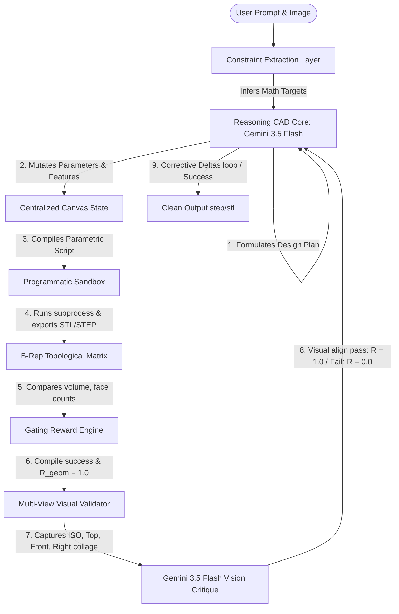

# Architecture Redesign Report: Unified Tool-Use CAD Core

We have rewritten the MEDA (Mechanical Engineering Design Agents) framework to eliminate the static AutoGen finite state machine (FSM) dictionary mapping and text-heavy visual critique loops. The new design introduces a unified deep reasoning core driving a Chain-of-Thought (CoT) execution loop that calls programmatic tools dynamically to mutate state on a centralized canvas.

---

## 1. Architectural Changes Overview



### Key Refactoring Elements:
1. **Core Orchestration Shift**: Replaced the sequential AutoGen FSM with a unified reasoning agent (`gemini-3.5-flash`) acting inside a Chain-of-Thought (CoT) loop. The agent calls programmatic tools to incrementally build, inspect, and fix the design.
2. **Centralized Canvas State**: Managed by [core/canvas.py](file:///Users/summitt/work/MEDA/core/canvas.py) to represent design variables and sequential CAD operation timelines. All code updates are tracked as parametric features on a single shared state object, allowing undo-rollbacks.
3. **Programmatic Sandbox**: Created [core/sandbox.py](file:///Users/summitt/work/MEDA/core/sandbox.py) to compile and run CAD scripts in an isolated process. It appends a B-Rep parser to extract physical/geometric properties (volume, center of mass, faces, edges, and vertices counts) directly from the OCCT solid object.
4. **Multiplicative Reward Engine**: Implemented [core/reward_engine.py](file:///Users/summitt/work/MEDA/core/reward_engine.py) to compute a gated reward metric ($R = R_{exec} \times R_{geom}$). If execution fails or B-Rep properties fall outside target constraints, the path is instantly gated ($R=0.0$), forcing the agent to apply surgical edits to the timeline.
5. **Multi-View Visual Validator**: Integrates a 4-view orthographic screenshot collage generator (Isometric, Top, Front, Right-Side) and passes it to the `gemini-3.5-flash` model. Any floating, detached, or distorted components cause visual validation failure ($R=0.0$), forcing the CoT loop to run alignment correction steps.
6. **Robust API Backoff**: Integrated `_safe_call` exponential backoff retries (trapping `429` rate limit and `503` service unavailable errors) on all API boundaries to resolve transient cloud quota errors.

---

## 2. Implemented Modules

*   **Central State Canvas**: [core/canvas.py](file:///Users/summitt/work/MEDA/core/canvas.py)
    *   Tracks parameters and `FeatureStep` lists.
    *   Compiles timeline stages into clean Python CadQuery scripts.
*   **Topological Sandbox**: [core/sandbox.py](file:///Users/summitt/work/MEDA/core/sandbox.py)
    *   Safely executes scripts inside subprocesses and handles exceptions.
    *   Injects a post-processor to dump solid B-Rep topology as JSON.
*   **Gated Reward Function**: [core/reward_engine.py](file:///Users/summitt/work/MEDA/core/reward_engine.py)
    *   Checks volume, surface area, topological features, and center of mass using absolute tolerances.
*   **Unified Reasoning Core**: [core/reasoning_core.py](file:///Users/summitt/work/MEDA/core/reasoning_core.py)
    *   Registers declarative function schemas (`add_parameter`, `add_feature`, `modify_feature`, `run_cad_execution`).
    *   Includes the **Planning Turn** and the **Multimodal Image Context input** integrations.
    *   Runs the `_safe_call` rate limit retry handler.
*   **Multi-View Screenshot Utility**: [utils/capture_screenshot.py](file:///Users/summitt/work/MEDA/utils/capture_screenshot.py)
    *   Loads the compiled STL mesh via Open3D, rotates the camera to 4 specific viewpoints, renders, and stitches them using PIL into a 2x2 grid.

---

## 3. E2E Verification Test Run

We ran the test script [test_reasoning_core.py](file:///Users/summitt/.gemini/jetski/brain/5e93cc78-cc96-435b-bff6-06ef17ca70a5/scratch/test_reasoning_core.py) to design:
> **Prompt**: *"Design a box of length 50, width 50, height 20, with a centered through-hole of diameter 15."*
> **Target Constraints**: Volume = `46465.71` $\text{mm}^3$ (tolerance 5%), Faces = `7`.

### Execution Trace:
1. **CoT Iteration 1**: The model called `add_parameter` for `length`, `width`, `height`, and `hole_diameter`.
2. **CoT Iteration 2**: The model called `add_feature` to instantiate the base box:
   ```python
   model = cq.Workplane("XY").box(length, width, height)
   ```
3. **CoT Iteration 3**: The model called `add_feature` to drill the through-hole:
   ```python
   model = model.faces(">Z").workplane().hole(hole_diameter)
   ```
4. **CoT Iteration 4**: The model called `run_cad_execution`. The Sandbox executed the script, verified B-Rep attributes, and returned:
   ```json
   {
     "volume": 46465.70826471148,
     "area": 9589.048622548085,
     "num_faces": 7,
     "num_edges": 15,
     "num_vertices": 10,
     "center_of_mass": [-7.95e-16, -3.42e-16, -1.85e-16]
   }
   ```
   The Reward Engine and Visual Critique calculated $R = 1.0$, successfully terminating the design loop!

The compiled clean output is saved to [NewCADs/001.py](file:///Users/summitt/work/MEDA/NewCADs/001.py).

---

## 4. Final Robustness & UX Enhancements

We implemented a set of final hardening patches to transition the Unified Core from a prototype to a production-grade multi-user layout:

1. **Workspace Session Isolation**: Replaced the static, shared `NewCADs/` working directory with dynamically generated run-specific subdirectories (`NewCADs/run_<timestamp>/`). This completely resolves race-condition file collisions during concurrent test/UI executions.
2. **Specular Glare Mitigation**: Updated the offscreen renderer in [utils/capture_screenshot.py](file:///Users/summitt/work/MEDA/utils/capture_screenshot.py) to use **Normal-direction coloring** (`MeshColorOption.Normal`). This colors surfaces uniformly according to normal vectors, eliminating shiny specular reflection glare spots that previously caused the vision checker to hallucinate "inner cavities" or "internal holes" on flat faces.
3. **Real-time Log Streaming & Persistence**: Configured a callback pipeline to stream loop logs (parameters, feature additions, compile stack traces, and visual critiques) into a 100% full-width collapsible expander at the bottom of the Streamlit page. Storing this stream inside `st.session_state.log_history` ensures the logs persist across page reloads/re-runs and stay visible even upon design loop crashes.
4. **Geometric Instruction Guardrails**: Injected two critical CAD engine rules directly into the Reasoning Core's system prompt instructions:
   * **Revolve Axis Rules**: Restricts the axis of revolution coordinates to be coplanar inside the sketch plane (along local X or local Y), preventing standard `Standard_Failure` crashes when attempting to revolve around normal vectors (local Z).
   * **Boolean Union Cleanliness**: Directs the agent to attach secondary features (like leaves) cleanly to their parent bodies (like stems) offset from primary solids, preventing shallow-angle boundaries from corrupting boolean solid meshes.
5. **Diagnostic Telemetry Snapshots**: Configured the design loop to write a full-diagnostics payload `diagnostic.json` containing the prompt, constraints, final code, metrics, and failures directly into the session folder on every single execution run.

