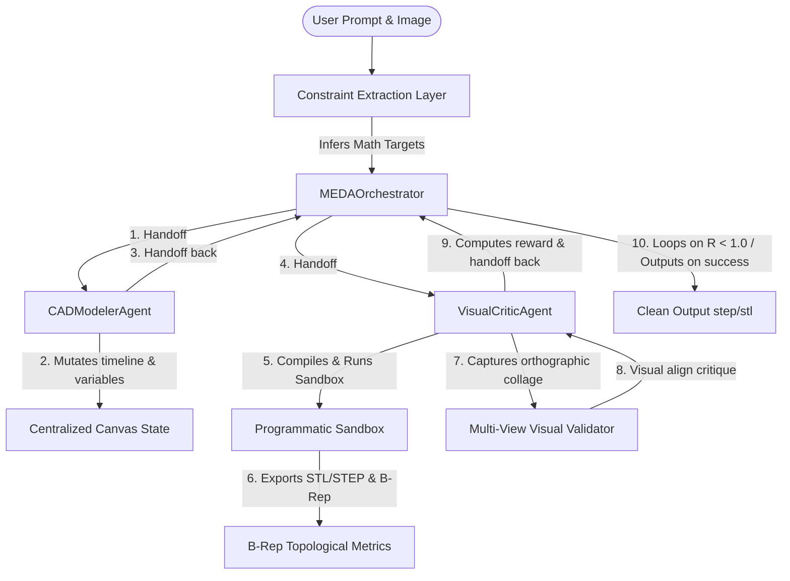

# Architecture Redesign Report: Multi-Agent Tool-Use CAD Core

We have redesigned the MEDA (Mechanical Engineering Design Agents) framework, transitioning from legacy AutoGen finite state machines and Conda environments to a modern **`uv` workspace** and **Google ADK** (as pinned in `pyproject.toml` / `uv.lock`) multi-agent orchestrator. The design loop now uses specialized sub-agents coordinating through native transfers to design, compile, and visually verify CAD models.

---

## 1. Architectural Changes Overview

### Key Refactoring Elements:
1. **Google ADK Orchestration**: Replaced the AutoGen group chats with a structured multi-agent routing loop:
   * **`MEDAOrchestrator`**: The coordinator responsible for aligning design requirements, tracking loop convergence, and orchestrating delegation handoffs.
   * **`CADModelerAgent`**: A dedicated agent with access to feature and parameter mutation tools (`add_parameter`, `set_parameter`, `add_feature`, `modify_feature`, `remove_feature`) to edit the canvas timeline.
   * **`VisualCriticAgent`**: A dedicated agent with access to the execution sandbox and reward system (`run_cad_execution`) to compile models and verify structural metrics.
2. **Deterministic Handoff Loops**: Implemented native ADK `transfer_to_agent` handoffs to direct execution flows between the orchestrator and its specialists. This avoids LLM-based speaker-selection overhead and should reduce orchestration latency/token use compared with free-form group-chat routing.
3. **`uv` Workspace Environment**: Migrated the legacy Conda environment to a lightweight `uv` configuration declared in `pyproject.toml`. This resolves version lock mismatches and accelerates local package resolution.
4. **Resilient HTTP Backoffs**: Subclassed `Gemini` into a custom `RetryingGemini` class that registers an explicit 8-attempt exponential backoff retry strategy for `503 UNAVAILABLE` and `429 RATE_LIMIT` status codes, neutralizing transient API server spikes.
5. **Centralized Canvas State**: Managed by [core/canvas.py](../core/canvas.py) to represent parameters and sequential CAD features. All ocp_vscode dependencies have been stripped to prevent compilation crashes in environments without VS Code extensions.
6. **Programmatic Sandbox**: Created [core/sandbox.py](../core/sandbox.py) to compile and run CAD scripts in an isolated process, executing topology and B-Rep extraction directly from the OCCT solid objects.
7. **Gated Reward Engine**: Configures a multiplicative reward $R = R_{exec} \times R_{geom}$ to verify compile/model-build success plus configured constraints such as volume, B-Rep counts, center of mass, or reference-shape distance. Surface area, solid count, and validity are emitted as metrics for downstream inspection; a failure in topology constraints or vision critique ($R_{vision} = 0.0$) gates the reward to $0.0$, driving the modeler agent to perform corrective timeline edits.

---

## 2. Implemented Modules

*   **Central State Canvas**: [core/canvas.py](../core/canvas.py)
    *   Tracks parameters and `FeatureStep` lists.
    *   Generates compile-ready CadQuery scripts with clean standard imports.
*   **Topological Sandbox**: [core/sandbox.py](../core/sandbox.py)
    *   Safely executes scripts inside subprocesses using `sys.executable`.
    *   Injects a post-processor to dump solid B-Rep topology as JSON.
*   **Gated Reward Function**: [core/reward_engine.py](../core/reward_engine.py)
    *   Checks volume, B-Rep counts, center of mass, and optional reference-shape distances using configured tolerances. Surface area is extracted by the sandbox but is not currently a default reward gate.
*   **Unified Multi-Agent Solver**: [core/reasoning_core.py](../core/reasoning_core.py)
    *   Defines `RetryingGemini`, `MEDAOrchestrator`, `CADModelerAgent`, and `VisualCriticAgent`.
    *   Integrates interactive log callbacks, custom API key parameters, and telemetry snapshots.
*   **Multi-View Screenshot Utility**: [utils/capture_screenshot.py](../utils/capture_screenshot.py)
    *   Loads STL meshes via Open3D, rotates the camera to 4 specific viewpoints, renders, and stitches them using PIL.
*   **Active Streamlit Application**: [streamlitapp.py](../streamlitapp.py)
    *   Configures LLM sidebar settings, displays 3D model loaders, and provides full-width live trace log streams.

---

## 3. Robustness & UX Enhancements

1. **Workspace Session Isolation**: Replaced the static, shared working directory with dynamically generated run-specific subdirectories (`NewCADs/run_<timestamp>/`). This completely resolves race-condition file collisions during concurrent test/UI executions.
2. **Specular Glare Mitigation**: Colors rendered surfaces uniformly according to normal vectors using Open3D's `Normal` coloring option, eliminating specular glare that previously caused the vision critic to hallucinate surface cavities.
3. **Log Persistence**: Logs are preserved in `st.session_state.log_history` to prevent console output from disappearing on page reload/refresh events.
4. **Diagnostic Telemetry**: Saves a full payload `diagnostic.json` containing the prompt, constraints, iterations, code, metrics, and failures directly into the session folder on every single execution run.
5. **No ocp_vscode dependencies**: Default canvas imports are restricted to pure `cadquery` to prevent runtime `ModuleNotFoundError` during headless execution.
